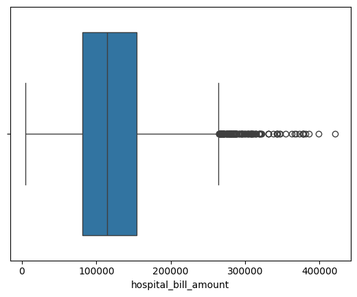
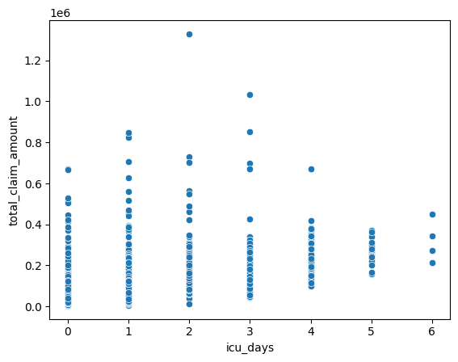
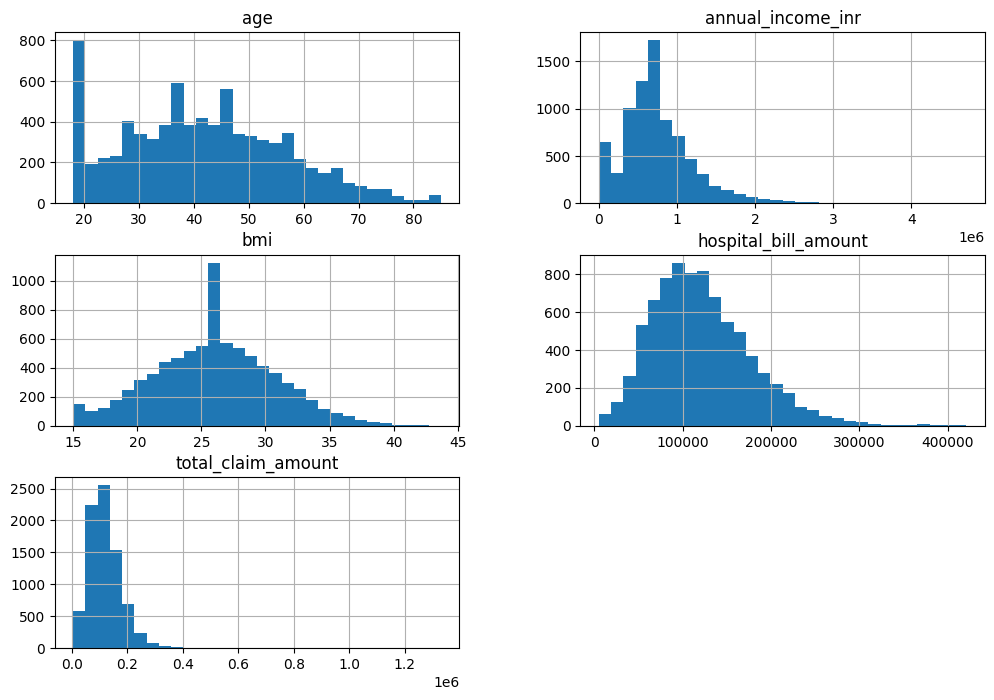
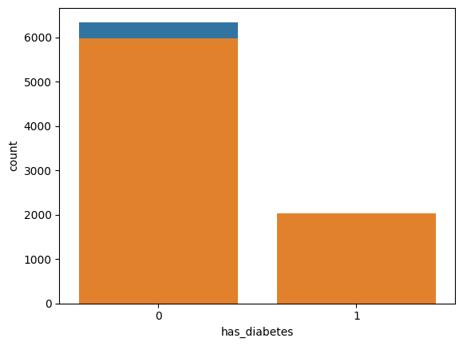
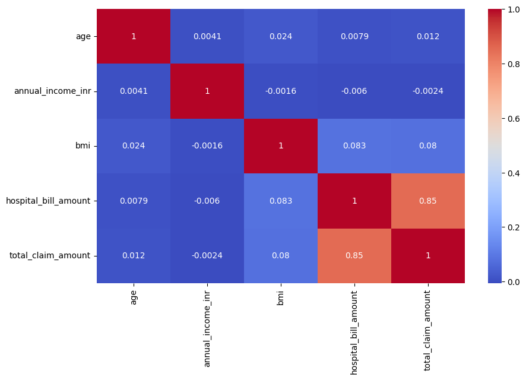
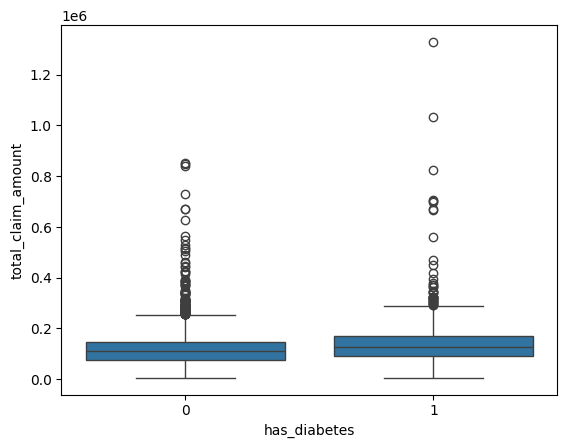

HEALTHCARE CLAIMS EDA — Setup & Data Loading

.. code:: ipython3

    import pandas as pd
    import numpy as np
    import matplotlib.pyplot as plt
    import matplotlib.ticker as mticker
    import seaborn as sns
    import warnings
    
    warnings.filterwarnings("ignore")

2. LOAD RAW CSV

.. code:: ipython3

    FILE_PATH = r"D:\Vidhya Learning\dataset\Decode labs dataset\indian_health_insurance_claims_dataset.csv"
    
    df_raw = pd.read_csv(FILE_PATH)
    
    print(f"Raw shape : {df_raw.shape[0]:,} rows × {df_raw.shape[1]} columns")
    print(f"Columns   : {df_raw.columns.tolist()}\n")

.. parsed-literal::

    Raw shape : 8,000 rows × 38 columns
    Columns   : ['policy_id', 'customer_name', 'gender', 'age', 'marital_status', 'state', 'city', 'pincode', 'aadhaar_masked', 'occupation_type', 'annual_income_inr', 'bmi', 'tobacco_usage', 'alcohol_units_per_week', 'physical_activity_level', 'diet_type', 'has_diabetes', 'has_hypertension', 'family_history_cardiac', 'stress_level_score', 'policy_type', 'sum_insured', 'policy_start_date', 'claim_date', 'hospital_name', 'hospital_tier', 'room_category', 'icu_days', 'length_of_stay', 'cashless_claim', 'agent_channel', 'hospital_bill_amount', 'pre_hospitalization_expense', 'post_hospitalization_expense', 'non_payable_items', 'deductible_amount', 'co_pay_amount', 'total_claim_amount']
    
    

2. CHECK DATA FOR CLEANING

.. code:: ipython3

    df_raw.head(20)
    df_raw.dtypes

.. parsed-literal::

    policy_id                        object
    customer_name                    object
    gender                           object
    age                               int64
    marital_status                   object
    state                            object
    city                             object
    pincode                           int64
    aadhaar_masked                   object
    occupation_type                  object
    annual_income_inr                object
    bmi                             float64
    tobacco_usage                    object
    alcohol_units_per_week            int64
    physical_activity_level          object
    diet_type                        object
    has_diabetes                    float64
    has_hypertension                float64
    family_history_cardiac            int64
    stress_level_score              float64
    policy_type                      object
    sum_insured                       int64
    policy_start_date                object
    claim_date                       object
    hospital_name                    object
    hospital_tier                    object
    room_category                    object
    icu_days                          int64
    length_of_stay                    int64
    cashless_claim                   object
    agent_channel                    object
    hospital_bill_amount             object
    pre_hospitalization_expense     float64
    post_hospitalization_expense    float64
    non_payable_items               float64
    deductible_amount               float64
    co_pay_amount                   float64
    total_claim_amount               object
    dtype: object

.. code:: ipython3

    df_raw.isnull().sum()

.. parsed-literal::

    policy_id                         0
    customer_name                     0
    gender                            0
    age                               0
    marital_status                    0
    state                             0
    city                              0
    pincode                           0
    aadhaar_masked                    0
    occupation_type                   0
    annual_income_inr               560
    bmi                             560
    tobacco_usage                     0
    alcohol_units_per_week            0
    physical_activity_level           0
    diet_type                         0
    has_diabetes                    383
    has_hypertension                391
    family_history_cardiac            0
    stress_level_score              560
    policy_type                       0
    sum_insured                       0
    policy_start_date                 0
    claim_date                        0
    hospital_name                     0
    hospital_tier                     0
    room_category                     0
    icu_days                          0
    length_of_stay                    0
    cashless_claim                    0
    agent_channel                     0
    hospital_bill_amount              0
    pre_hospitalization_expense       0
    post_hospitalization_expense      0
    non_payable_items                 0
    deductible_amount                 0
    co_pay_amount                     0
    total_claim_amount                0
    dtype: int64

DATA CLEANING

FIX total_claim_amount (mixed formats — plain float & ₹-prefixed
strings) Examples in data: 162494.46 → already a float “₹151,678” →
rupee symbol + Indian comma formatting “₹1,46,969” → lakh-style commas

.. code:: ipython3

     """Strip ₹, remove all commas, convert to float."""
    
    def parse_claim_amount(val):
       return float(str(val).replace("₹", "").replace(",", "").strip())
    
    df_raw["total_claim_amount"] = df_raw["total_claim_amount"].apply(parse_claim_amount)
    
    print("total_claim_amount — after fix:")
    print(df_raw["total_claim_amount"].describe().apply(lambda x: f"{x:,.2f}"))
    print()

.. parsed-literal::

    total_claim_amount — after fix:
    count        8,000.00
    mean       121,636.20
    std         65,843.87
    min          5,000.00
    25%         79,352.72
    50%        111,817.29
    75%        152,470.29
    max      1,329,765.90
    Name: total_claim_amount, dtype: object
    
    

Clean hospital_bill_amount: remove ₹ and commas, convert to float

.. code:: ipython3

     """Strip ₹, remove all commas, convert to float."""
    
    def parse_hospital_bill_amount(val):
       return float(str(val).replace("₹", "").replace(",", "").strip())
    df_raw["hospital_bill_amount"] = df_raw["hospital_bill_amount"].apply(parse_hospital_bill_amount)
    
    print("hospital_bill_amount — after fix:")
    print(df_raw["hospital_bill_amount"].describe().apply(lambda x: f"{x:,.2f}"))
    print()

.. parsed-literal::

    hospital_bill_amount — after fix:
    count      8,000.00
    mean     121,532.36
    std       55,850.68
    min        5,000.00
    25%       81,220.91
    50%      114,729.79
    75%      154,407.39
    max      421,457.80
    Name: hospital_bill_amount, dtype: object
    
    

Clean annual_income_inr: remove “LPA”, strip spaces, convert to float

.. code:: ipython3

    """ Strip, remove LPA, remove nan, convert to float"""
    
    def parse_annual_income_inr(val):
        s = str(val).replace("LPA", "").strip()
        if s.lower() == "nan" or s == "":
            return None
        return float(s)
    
    df_raw["annual_income_inr"] = df_raw["annual_income_inr"].apply(parse_annual_income_inr)
    
    print("annual_income_inr — after fix:")
    print(df_raw["annual_income_inr"].describe().apply(lambda x: f"{x:,.2f}"))
    print()
        

.. parsed-literal::

    annual_income_inr — after fix:
    count        7,440.00
    mean       759,700.38
    std        491,148.56
    min              1.50
    25%        456,807.45
    50%        688,884.54
    75%      1,001,812.29
    max      4,703,966.62
    Name: annual_income_inr, dtype: object
    
    

PARSE DATE COLUMNS

.. code:: ipython3

    date_cols = ["policy_start_date", "claim_date"]
    
    for col in date_cols:
        df_raw[col] = pd.to_datetime(df_raw[col], errors="coerce")
    
    # Derived time features
    df_raw["policy_duration_days"] = (
        df_raw["claim_date"] - df_raw["policy_start_date"]
    ).dt.days
    
    df_raw["claim_year"]  = df_raw["claim_date"].dt.year
    df_raw["claim_month"] = df_raw["claim_date"].dt.month
    df_raw["claim_month_name"] = df_raw["claim_date"].dt.strftime("%b")
    
    print("Date columns parsed. Sample:")
    print(df_raw[["policy_start_date", "claim_date", "policy_duration_days"]].head(3))
    print()

.. parsed-literal::

    Date columns parsed. Sample:
      policy_start_date claim_date  policy_duration_days
    0        2019-09-13 2022-04-23                   953
    1        2021-12-11 2023-11-04                   693
    2        2021-05-20 2023-03-20                   669
    
    

STANDARDIZE gender (6 variants → ‘Male’ / ‘Female’)

.. code:: ipython3

    gender_map = {
        "M":      "Male",
        "male":   "Male",
        "Male":   "Male",
        "F":      "Female",
        "female": "Female",
        "Female": "Female",
    }
    
    df_raw["gender"] = df_raw["gender"].map(gender_map)
    
    print("Gender after standardization:")
    print(df_raw["gender"].value_counts())
    print()

.. parsed-literal::

    Gender after standardization:
    gender
    Female    4040
    Male      3960
    Name: count, dtype: int64
    
    

STANDARDIZE OTHER CATEGORICAL COLUMNS

.. code:: ipython3

    # Title-case marital_status  (mixed casing in source)
    df_raw["marital_status"] = df_raw["marital_status"].str.strip().str.title()
    
    # Lower-case cashless_claim for consistency
    df_raw["cashless_claim"] = df_raw["cashless_claim"].str.strip().str.lower()
    
    # Strip whitespace from all string columns
    str_cols = df_raw.select_dtypes(include="object").columns
    for col in str_cols:
        df_raw[col] = df_raw[col].str.strip()
    

DATA TYPE CONVERSIONS

.. code:: ipython3

    # Binary health flags → nullable Int8 (keeps NaN support)
    bool_cols = ["has_diabetes", "has_hypertension", "family_history_cardiac"]
    for col in bool_cols:
        df_raw[col] = df_raw[col].astype("Int8")
    
    # Sum insured as integer
    df_raw["sum_insured"] = df_raw["sum_insured"].astype(int)

MISSING VALUE SUMMARY

.. code:: ipython3

    missing = df_raw.isnull().sum()
    missing = missing[missing > 0].sort_values(ascending=False)
    missing_pct = (missing / len(df_raw) * 100).round(2)
    
    missing_df = pd.DataFrame({
        "Missing Count": missing,
        "Missing %":     missing_pct,
    })
    print("Missing values:\n", missing_df.to_string(), "\n")

.. parsed-literal::

    Missing values:
                         Missing Count  Missing %
    annual_income_inr             560       7.00
    bmi                           560       7.00
    stress_level_score            560       7.00
    has_hypertension              391       4.89
    has_diabetes                  383       4.79 
    
    

MISSING VALUE HANDLING

.. code:: ipython3

    # Impute numeric with median, categorical with mode
    for col in df_raw.columns:
        if df_raw[col].isna().sum() > 0:
            if pd.api.types.is_numeric_dtype(df_raw[col]):
                df_raw[col].fillna(df_raw[col].median(), inplace=True)
            else:
                df_raw[col].fillna(df_raw[col].mode()[0], inplace=True)
    df_raw.isnull().sum()

.. parsed-literal::

    policy_id                       0
    customer_name                   0
    gender                          0
    age                             0
    marital_status                  0
    state                           0
    city                            0
    pincode                         0
    aadhaar_masked                  0
    occupation_type                 0
    annual_income_inr               0
    bmi                             0
    tobacco_usage                   0
    alcohol_units_per_week          0
    physical_activity_level         0
    diet_type                       0
    has_diabetes                    0
    has_hypertension                0
    family_history_cardiac          0
    stress_level_score              0
    policy_type                     0
    sum_insured                     0
    policy_start_date               0
    claim_date                      0
    hospital_name                   0
    hospital_tier                   0
    room_category                   0
    icu_days                        0
    length_of_stay                  0
    cashless_claim                  0
    agent_channel                   0
    hospital_bill_amount            0
    pre_hospitalization_expense     0
    post_hospitalization_expense    0
    non_payable_items               0
    deductible_amount               0
    co_pay_amount                   0
    total_claim_amount              0
    policy_duration_days            0
    claim_year                      0
    claim_month                     0
    claim_month_name                0
    dtype: int64

Convert other numeric columns safely

.. code:: ipython3

    numeric_cols = [
        "age", "annual_income_inr", "bmi",
        "alcohol_units_per_week", "stress_level_score",
        "icu_days", "length_of_stay",
        "hospital_bill_amount", "total_claim_amount",
        "policy_duration_days",
    ]
    
    df_raw[numeric_cols] = df_raw[numeric_cols].apply(pd.to_numeric, errors="coerce")

NUMERIC SUMMARY TABLE

.. code:: ipython3

    for col in numeric_cols:
        bad_values = df_raw[col][pd.to_numeric(df_raw[col], errors="coerce").isna()]
        if not bad_values.empty:
            print(f"Non-numeric values in {col}:", bad_values.unique())

.. code:: ipython3

    for col in numeric_cols:
        # notna() excludes genuine NaNs — only flags actual bad strings
        mask = pd.to_numeric(df_raw[col], errors="coerce").isna() & df_raw[col].notna()
        bad_values = df_raw[col][mask]
        
        if not bad_values.empty:
            print(f"Non-numeric values in {col}:", bad_values.unique())
        else:
            print(f"{col} — OK")

.. parsed-literal::

    age — OK
    annual_income_inr — OK
    bmi — OK
    alcohol_units_per_week — OK
    stress_level_score — OK
    icu_days — OK
    length_of_stay — OK
    hospital_bill_amount — OK
    total_claim_amount — OK
    policy_duration_days — OK
    

Convert other numeric columns safely

.. code:: ipython3

    numeric_cols = [
        "age", "annual_income_inr", "bmi",
        "alcohol_units_per_week", "stress_level_score",
        "icu_days", "length_of_stay",
        "hospital_bill_amount", "total_claim_amount",
        "policy_duration_days",
    ]
    
    df_raw[numeric_cols] = df_raw[numeric_cols].apply(pd.to_numeric, errors="coerce")

Clean Copy

.. code:: ipython3

    df = df_raw.copy()

DATASET OVERVIEW PRINTOUT

.. code:: ipython3

    print("=" * 55)
    print("  DATASET OVERVIEW")
    print("=" * 55)
    print(f"  Rows              : {len(df):,}")
    print(f"  Columns           : {df.shape[1]}")
    print(f"  Date range        : {df['claim_date'].min().date()} → {df['claim_date'].max().date()}")
    print(f"  States covered    : {df['state'].nunique()} ({', '.join(df['state'].unique())})")
    print(f"  Unique hospitals  : {df['hospital_name'].nunique():,}")
    print(f"  Policy types      : {', '.join(df['policy_type'].unique())}")
    print(f"  Mean claim amount : ₹{df['total_claim_amount'].mean():,.0f}")
    print(f"  Median claim amt  : ₹{df['total_claim_amount'].median():,.0f}")
    print(f"  Max claim amount  : ₹{df['total_claim_amount'].max():,.0f}")
    print(f"  Cashless claims   : {(df['cashless_claim']=='yes').mean()*100:.1f}%")
    print("=" * 55)

.. parsed-literal::

    =======================================================
      DATASET OVERVIEW
    =======================================================
      Rows              : 8,000
      Columns           : 42
      Date range        : 2018-03-02 → 2029-05-24
      States covered    : 6 (Tamil Nadu, Karnataka, West Bengal, Delhi, Uttar Pradesh, Maharashtra)
      Unique hospitals  : 7,188
      Policy types      : individual, family_floater, senior_citizen
      Mean claim amount : ₹121,636
      Median claim amt  : ₹111,817
      Max claim amount  : ₹1,329,766
      Cashless claims   : 69.6%
    =======================================================
    

Descriptive Statistics

.. code:: ipython3

    summary = df[numeric_cols].agg(["count", "mean", "median", "std", "min", "max"])
    summary = summary.T
    summary.columns = ["Count", "Mean", "Median", "Std Dev", "Min", "Max"]
    print("\nNumeric column summary:\n")
    print(summary)
    print(summary.to_string())

.. parsed-literal::

    
    Numeric column summary:
    
                             Count           Mean         Median        Std Dev  \
    age                     8000.0      41.765750      41.000000      15.099748   
    annual_income_inr       8000.0  754743.269506  688884.540000  473988.846439   
    bmi                     8000.0      25.990243      25.996548       4.730384   
    alcohol_units_per_week  8000.0       3.002750       3.000000       1.732301   
    stress_level_score      8000.0       5.034059       5.030104       1.870815   
    icu_days                8000.0       0.997625       1.000000       0.996365   
    length_of_stay          8000.0       3.988250       4.000000       2.002464   
    hospital_bill_amount    8000.0  121532.362596  114729.795000   55850.678825   
    total_claim_amount      8000.0  121636.199029  111817.290000   65843.867334   
    policy_duration_days    8000.0    1016.970875    1026.500000     570.459242   
    
                               Min           Max  
    age                       18.0  8.500000e+01  
    annual_income_inr          1.5  4.703967e+06  
    bmi                       15.0  4.368266e+01  
    alcohol_units_per_week     0.0  1.100000e+01  
    stress_level_score         1.0  1.000000e+01  
    icu_days                   0.0  6.000000e+00  
    length_of_stay             0.0  1.300000e+01  
    hospital_bill_amount    5000.0  4.214578e+05  
    total_claim_amount      5000.0  1.329766e+06  
    policy_duration_days      30.0  2.000000e+03  
                             Count           Mean         Median        Std Dev     Min           Max
    age                     8000.0      41.765750      41.000000      15.099748    18.0  8.500000e+01
    annual_income_inr       8000.0  754743.269506  688884.540000  473988.846439     1.5  4.703967e+06
    bmi                     8000.0      25.990243      25.996548       4.730384    15.0  4.368266e+01
    alcohol_units_per_week  8000.0       3.002750       3.000000       1.732301     0.0  1.100000e+01
    stress_level_score      8000.0       5.034059       5.030104       1.870815     1.0  1.000000e+01
    icu_days                8000.0       0.997625       1.000000       0.996365     0.0  6.000000e+00
    length_of_stay          8000.0       3.988250       4.000000       2.002464     0.0  1.300000e+01
    hospital_bill_amount    8000.0  121532.362596  114729.795000   55850.678825  5000.0  4.214578e+05
    total_claim_amount      8000.0  121636.199029  111817.290000   65843.867334  5000.0  1.329766e+06
    policy_duration_days    8000.0    1016.970875    1026.500000     570.459242    30.0  2.000000e+03
    

Trend & Outlier Detection

.. code:: ipython3

    # Outliers in hospital bills
    sns.boxplot(x=df["hospital_bill_amount"])
    plt.show()
    
    # ICU days vs claim amount
    sns.scatterplot(x="icu_days", y="total_claim_amount", data=df)
    plt.show()

Hospital Bill Amount-Box Plot

- The distribution is right-skewed: most hospital bills fall between ₹50,000–₹150,000, but there are extreme outliers above ₹300,000.
- These outliers highlight high-cost cases that could be linked to longer ICU stays or complex treatments.
- Median bills are relatively modest compared to the maximum, showing a large disparity in healthcare costs.

ICU days and Cliam Amount

- Claim amounts vary widely for each ICU day count, suggesting ICU stay alone doesn’t fully explain claim size.
- Outliers exist even at low ICU days (e.g., 1–2 days with very high claims), indicating that other factors like treatment type or hospital billing practices drive costs.
- Correlation between ICU days and claim amount is weak, but average claims tend to rise with ICU days.

Univarative Analysis

.. code:: ipython3

    # Histograms
    numeric_cols = ["age","annual_income_inr","bmi","hospital_bill_amount","total_claim_amount"]
    df[numeric_cols].hist(figsize=(12,8), bins=30)
    plt.show()
    
    # Bar plots for categorical
    sns.countplot(x="has_diabetes", data=df)
    sns.countplot(x="has_hypertension", data=df)
    

.. parsed-literal::

    <Axes: xlabel='has_diabetes', ylabel='count'>

Age, Income, BMI, Hospitals Bills & Claims

- Age: Concentration around younger adults (~20 years), with smaller peaks in middle age.
- Income: Most incomes are below ₹1,000,000, but a few extend to ₹4,000,000, showing income inequality in the dataset.
- BMI: Peaks around 25, consistent with borderline overweight, which may be relevant for health risk analysis.
- Hospital Bills & Claims: Both show long tails, reinforcing the presence of cost outliers.

Bivariate Analysis

.. code:: ipython3

     
    # Correlation heatmap
    plt.figure(figsize=(10,6))
    sns.heatmap(df[numeric_cols].corr(), annot=True, cmap="coolwarm")
    plt.show()
    

Correlation Heatmap
- Strong correlation (0.84) between hospital bill amount and total claim amount — bills are the primary driver of claims.
- Other variables (age, income, BMI) show negligible correlations, meaning they don’t directly influence claim size.
- BMI has a weak positive correlation with bills/claims (~0.08), hinting at a possible health-cost link but not strong enough alone.

.. code:: ipython3

    
    # Claim amount vs diabetes
    sns.boxplot(x="has_diabetes", y="total_claim_amount", data=df)
    plt.show()
    
    # Claim amount vs hypertension
    sns.boxplot(x="has_hypertension", y="total_claim_amount", data=df)
    plt.show()
    

Diabetes & Hypertension Prevalence - Majority of patients do not have
diabetes or hypertension, but a significant minority does. - Boxplots
show similar median claim amounts for both groups, but outliers exist in
all categories. - This suggests chronic conditions alone don’t determine
high claims — multi-factor risk assessment is needed.

Key Insights

-  Hospital bills are the strongest predictor of claim amounts.
-  Outliers drive skewness in both bills and claims — insurers should investigate these cases separately.
-  ICU days and chronic conditions influence claims but are not sole drivers; costs are multifactorial.
-  The dataset reflects income inequality and health risk diversity, making it valuable for segmentation and risk modeling.

